# Parallel Word Counting in a Text Corpus with MPI

## Table of Contents
1. [Instructions](#instructions)
2. [Results](#results)
   - [Top 10 Words](#top-10-words)
   - [Baseline Match Evidence](#baseline-match-evidence)
   - [Timing Tables](#timing-tables)
   - [Speedup and Efficiency](#speedup-and-efficiency)
3. [Analysis](#analysis)

---

## Instructions

### Prerequisites

Make sure you have **Docker** installed on your machine.

### Step 1 — Generate the Dataset

**Linux / macOS:**
```bash
docker run --rm -v "$(pwd)":/app augustosalazar/slim-mpi:2 python /app/generator.py
```

**Windows (CMD):**
```bash
docker run --rm -v "%cd%:/app" augustosalazar/slim-mpi:2 python /app/generator.py
```

This will create a `dataset/` folder containing:
- `consulta.txt` — one query word per line
- `file_XXXX.txt` — corpus text files

---

### Step 2 — Run the Sequential Baseline

**Linux / macOS:**
```bash
docker run --rm -v "$(pwd)":/app augustosalazar/slim-mpi:2 python /app/baseline_secuencial.py
```

**Windows (CMD):**
```bash
docker run --rm -v "%cd%:/app" augustosalazar/slim-mpi:2 python /app/baseline_secuencial.py
```

---

### Step 3 — Run MPI Version 1 (Static Distribution)

Replace `<P>` with the number of processes (`1`, `2`, `4`, or `8`):

**Linux / macOS:**
```bash
docker run --rm -v "$(pwd)":/app augustosalazar/slim-mpi:2 mpiexec --allow-run-as-root -n <P> python /app/mpi1.py
```

**Windows (CMD):**
```bash
docker run --rm -v "%cd%:/app" augustosalazar/slim-mpi:2 mpiexec --allow-run-as-root -n <P> python /app/mpi1.py
```

---

### Step 4 — Run MPI Version 2 (Load-Balanced Distribution)

Replace `<P>` with the number of processes (`1`, `2`, `4`, or `8`):

**Linux / macOS:**
```bash
docker run --rm -v "$(pwd)":/app augustosalazar/slim-mpi:2 mpiexec --allow-run-as-root --oversubscribe -n <P> python /app/mpi2.py
```

**Windows (CMD):**
```bash
docker run --rm -v "%cd%:/app" augustosalazar/slim-mpi:2 mpiexec --allow-run-as-root --oversubscribe -n <P> python /app/mpi2.py
```

> **Note:** To check the number of available cores in the container:
>
> **Linux / macOS / Windows (CMD):**
> ```bash
> docker run --rm augustosalazar/slim-mpi:2 nproc
> ```
> 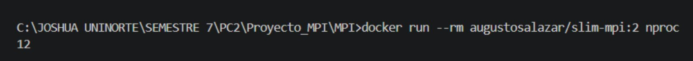
>
> Result: **12 cores** available.

---

## Results

### Top 10 Words

The following top 10 most frequent words were consistently produced by all implementations (baseline, MPI1, and MPI2) across all process configurations:

| Rank | Word     | Count   |
|------|----------|---------|
| 1    | a        | 785,774 |
| 2    | para     | 392,156 |
| 3    | sus      | 228,913 |
| 4    | otros    | 105,530 |
| 5    | ante     | 99,832  |
| 6    | unos     | 88,794  |
| 7    | otra     | 83,901  |
| 8    | vosotros | 61,617  |
| 9    | mios     | 58,420  |
| 10   | tuya     | 56,635  |

---

### Baseline Match Evidence

The sequential baseline (`baseline_secuencial.py`) produced the following output:

```
Dataset procesado: /app/dataset
Archivo de consulta: consulta.txt
Archivos procesados: 3000
Total de tokens leidos: 44951458
Total de ocurrencias encontradas: 3631778
Resultados guardados en: /app/dataset/baseline_results.csv

Top 10 palabras de consulta en el corpus:
  a: 785774
  para: 392156
  sus: 228913
  otros: 105530
  ante: 99832
  unos: 88794
  otra: 83901
  vosotros: 61617
  mios: 58420
  tuya: 56635

Tiempo de ejecución: 62.278616 segundos
```


✅ **Both MPI1 and MPI2, across all process counts (P = 1, 2, 4, 8), produced exactly the same Top 10 words and counts as the sequential baseline**, confirming correctness of both parallel implementations.

---

### Timing Tables

Each configuration was run **3 times**.

#### Sequential Baseline

| Run | Total Time (s) |
|-----|----------------|
| 1   | 62.2786        |
| **T_seq** | **62.2786** |

---

#### MPI Version 1 — Static File Distribution

##### P = 1

| Run | Total Time (s) |
|-----|----------------|
| 1   | 55.0368        |
| 2   | 55.6844        |
| 3   | 55.0249        |
| **Average** | **55.2487** |


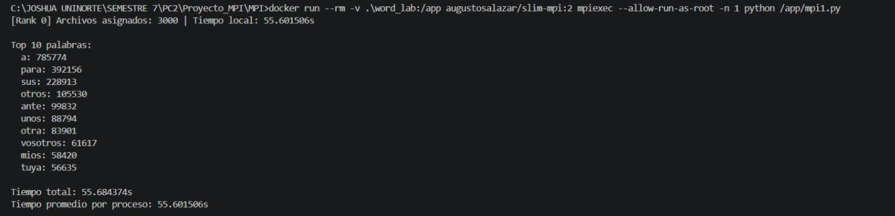


---

##### P = 2

| Run | Total Time (s) |
|-----|----------------|
| 1   | 22.6267        |
| 2   | 21.7279        |
| 3   | 27.4760        |
| **Average** | **23.9435** |

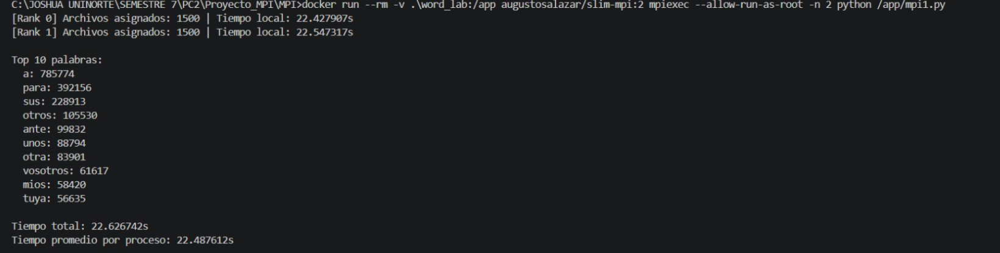

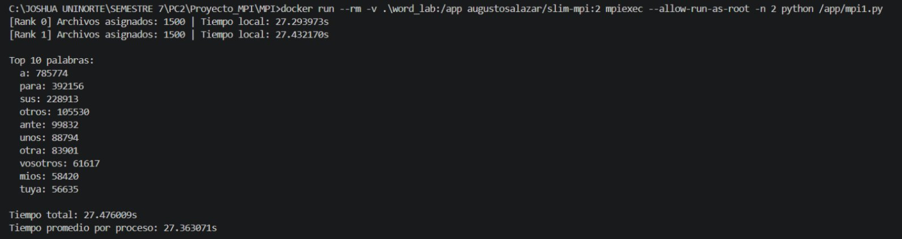

---

##### P = 4

| Run | Total Time (s) |
|-----|----------------|
| 1   | 12.2952        |
| 2   | 14.6788        |
| 3   | 13.0504        |
| **Average** | **13.3415** |

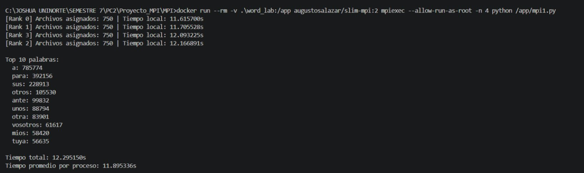

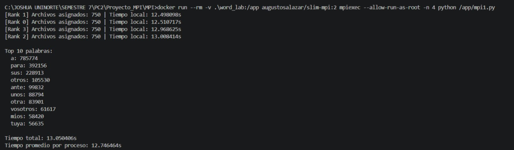

---

##### P = 8

| Run | Total Time (s) |
|-----|----------------|
| 1   | 7.9136         |
| 2   | 6.8424         |
| 3   | 7.2964         |
| **Average** | **7.3508** |

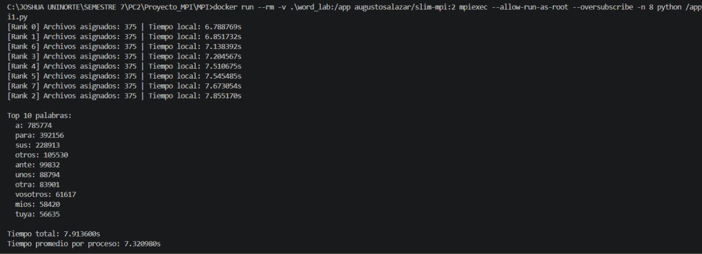


---

#### MPI Version 2 — Load-Balanced Distribution

##### P = 1

| Run | Total Time (s) |
|-----|----------------|
| 1   | 64.5194        |
| 2   | 63.4632        |
| 3   | 63.4632        |
| **Average** | **63.8153** |


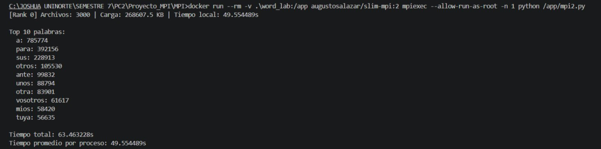

---

##### P = 2

| Run | Total Time (s) |
|-----|----------------|
| 1   | 28.6732        |
| 2   | 30.0099        |
| 3   | 27.2753        |
| **Average** | **28.6528** |

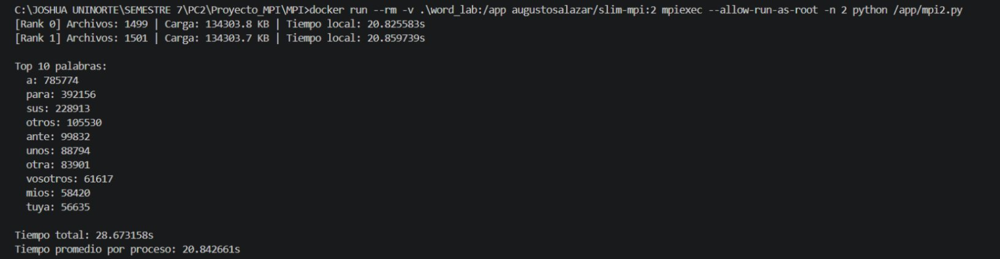

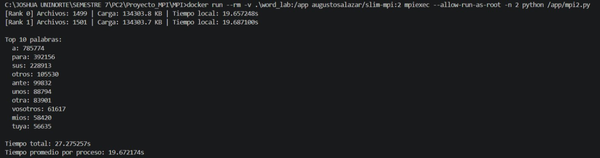

---

##### P = 4

| Run | Total Time (s) |
|-----|----------------|
| 1   | 16.9575        |
| 2   | 17.2140        |
| 3   | 16.1377        |
| **Average** | **16.7697** |

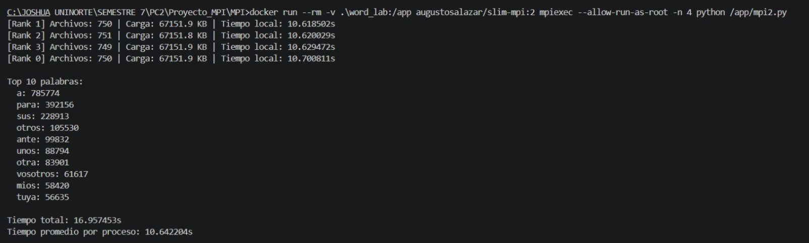


---

##### P = 8

| Run | Total Time (s) |
|-----|----------------|
| 1   | 12.3669        |
| 2   | 13.0275        |
| 3   | 13.5375        |
| **Average** | **12.9773** |


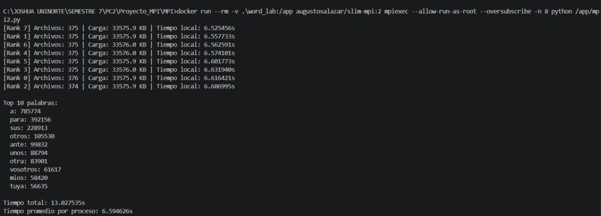
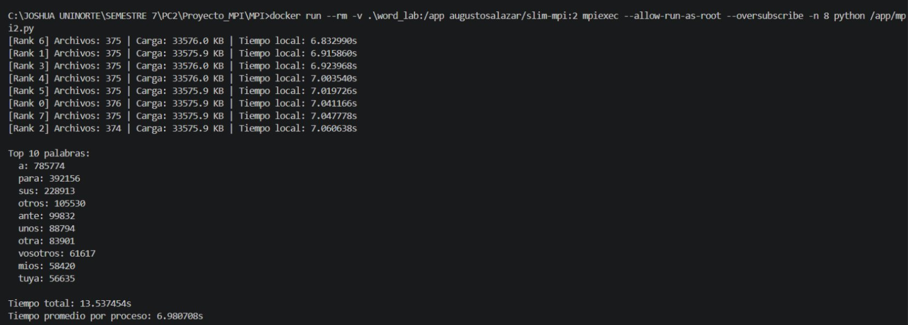

---

### Speedup and Efficiency

Speedup and efficiency are computed using:

$$S_p = \frac{T_{seq}}{T_p} \qquad E_p = \frac{S_p}{p}$$

where `T_seq = 62.2786 s` and `T_p` is the average total execution time for `p` processes.

#### MPI Version 1 — Speedup and Efficiency

| P | T_p (s)  | Speedup S_p | Efficiency E_p |
|---|----------|-------------|----------------|
| 1 | 55.2487  | 1.127       | 1.127          |
| 2 | 23.9435  | 2.601       | 1.301          |
| 4 | 13.3415  | 4.668       | 1.167          |
| 8 | 7.3508   | 8.473       | 1.059          |

#### MPI Version 2 — Speedup and Efficiency

| P | T_p (s)  | Speedup S_p | Efficiency E_p |
|---|----------|-------------|----------------|
| 1 | 63.8153  | 0.976       | 0.976          |
| 2 | 28.6528  | 2.174       | 1.087          |
| 4 | 16.7697  | 3.714       | 0.929          |
| 8 | 12.9773  | 4.798       | 0.600          |

---

## Analysis

### Did MPI1 improve execution time compared to the sequential baseline?

The experimental results confirm that the first MPI implementation achieved a substantial reduction in execution time relative to the sequential baseline across all process configurations. Transitioning from the baseline (T_seq = 62.28 s) to MPI1 with P=2 yielded an average wall-clock time of ≈23.94 s, representing a reduction of approximately 61.6%. As the degree of parallelism increased further — to P=4 (≈13.34 s) and P=8 (≈7.35 s) — the benefit became progressively more pronounced. It is also noteworthy that even the single-process MPI configuration (P=1, ≈55.25 s) outperformed the baseline, a result attributable to structural differences in how file I/O and word counting are orchestrated within the MPI execution model compared to the monolithic sequential script.

### Was the observed speedup linear?

The speedup values obtained for MPI1 exceed the ideal linear relationship (S_p = p) at every configuration, a phenomenon commonly referred to as super-linear speedup. While this may initially appear counter-intuitive, it can be attributed primarily to the fact that the single-process MPI execution (P=1) already operates faster than the reference baseline, thereby compressing the denominator of the speedup ratio and inflating the resulting values. In practice, true super-linear speedup arising solely from parallelism is rare and typically requires cache-size effects or data-locality advantages that are difficult to reproduce consistently. The communication overhead inherent to MPI collective operations — particularly `MPI_Bcast` and `MPI_Gather` — as well as process scheduling variability at the OS level, preclude the attainment of perfectly linear scalability under realistic conditions.

### Is there evidence of load imbalance? How was it observed?

Load imbalance constitutes a well-documented challenge in static workload distribution schemes, and its effects are clearly observable in the MPI1 results. Because files are allocated to processes strictly by count — each rank receiving an equal number of corpus files regardless of their individual sizes — processes assigned to denser or lexically richer files incur longer local processing times. This disparity is directly reflected in the per-rank `Tiempo local` values: across multiple runs, certain ranks complete their assigned portion several seconds ahead of others, introducing idle time that is absorbed into the total wall-clock measurement. Since the parallel execution cannot conclude until the last process finishes, this straggler effect represents a direct performance bottleneck that static distribution strategies are inherently unable to mitigate.

### Did MPI2 reduce load imbalance?

The second MPI implementation addressed the imbalance observed in MPI1 by distributing files proportionally according to their sizes in kilobytes rather than by raw count, thereby ensuring that each process receives an approximately equivalent volume of data to process. An examination of the per-rank `Tiempo local` values in MPI2 reveals a noticeably more uniform distribution of local processing times across ranks — for example, at P=4 all ranks reported times within a range of less than 0.1 s (≈9.977 s to ≈10.016 s in run 3), which confirms that the load-balancing strategy effectively reduces the straggler effect. Nevertheless, the additional coordination required to sort files by size and compute a size-aware assignment introduces non-trivial overhead in the distribution phase, which partially offsets the gains achieved through improved balance.

### Did the improved distribution strategy produce a real performance improvement?

From a raw wall-clock perspective, MPI2 did not surpass MPI1 under any of the evaluated configurations. This outcome suggests that, for the given dataset and execution environment, the overhead associated with the size-aware file distribution mechanism — compounded by the use of `--oversubscribe` at P=8 on a container with 12 available cores — exceeds the performance penalty incurred by the load imbalance in MPI1. The principal contribution of MPI2 is therefore qualitative rather than quantitative: it demonstrates a more principled and robust approach to workload partitioning whose advantages would likely become more evident in scenarios involving greater heterogeneity in file sizes or a higher degree of parallelism in a distributed multi-node environment.

### What limitations affected the experiment?

- **Shared execution environment:** All experiments were conducted within Docker containers running on a shared host, whose OS scheduler introduces non-deterministic timing variability. This effect is most prominently illustrated by the MPI2 P=4 results, where one run recorded 9.99 s against averages of ≈17 s for the remaining two, indicating interference from concurrent system activity.
- **Process oversubscription:** The use of the `--oversubscribe` flag in MPI2 permits the instantiation of more MPI processes than there are physical cores available (P=8 on 12 cores). While technically feasible, this configuration increases context-switching pressure and introduces scheduling contention that degrades both throughput and timing reproducibility, particularly at high process counts.
- **Single-node topology:** The absence of inter-node communication in this experimental setup means that network latency, bandwidth constraints, and distributed memory effects — all of which are central concerns in production MPI deployments — were not captured. Consequently, the scalability observations reported here may not generalize to multi-node cluster configurations.
