# Parallel Word Counting in a Text Corpus with MPI

**Course:** Systems and Computing  
**Team members:**
- María José Hernández 
- Joshua Lobo 
- Sebastián Santos
- Santiago Vengoechea 

---

## Table of Contents

1. [Problem Description](#1-problem-description)
2. [Environment and Execution Instructions](#2-environment-and-execution-instructions)
3. [Experimental Plan](#3-experimental-plan)
4. [Sequential Baseline](#4-sequential-baseline)
5. [MPI Version 1](#5-mpi-version-1)
6. [The Test Procedure](#6-the-test-procedure)
7. [Experimental Plan Execution](#7-experimental-plan-execution)
   - [Sequential Baseline Timing](#71-sequential-baseline-timing)
   - [MPI Version 1 Timing Results](#72-mpi-version-1-timing-results)
   - [Load Imbalance Evidence](#73-load-imbalance-evidence)
   - [MPI Version 2 — Load-Balanced Implementation](#74-mpi-version-2--load-balanced-implementation)
8. [Analysis](#8-analysis)
9. [Conclusions](#9-conclusions)

---

## 1. Problem Description

The goal of this lab is to count how many times each word from a query file (`consulta.txt`) appears across a large corpus of text files (`file_XXXX.txt`), and report the top 10 most frequent words.

This problem works well for parallelization because the corpus can be split into parts, each process handles its own subset independently, and the partial counts are merged at the end. Throughout the lab we explore how using MPI affects execution time and how the way we distribute the work across processes impacts performance and load balance.

The dataset is generated using a provided script and consists of:
- `consulta.txt` — one query word per line
- 3,000 corpus files (`file_XXXX.txt`)

---

## 2. Environment and Execution Instructions

### Prerequisites

Make sure you have **Docker** installed on your machine.

### Step 1 — Generate the Dataset

**Linux / macOS:**
```bash
docker run --rm -v "$(pwd)":/app augustosalazar/slim-mpi:2 python /app/generator.py
```

**Windows (CMD):**
```bash
docker run --rm -v "%cd%:/app" augustosalazar/slim-mpi:2 python /app/generator.py
```

This will create a `dataset/` folder containing:
- `consulta.txt` — one query word per line
- `file_XXXX.txt` — corpus text files

### Step 2 — Run the Sequential Baseline

**Linux / macOS:**
```bash
docker run --rm -v "$(pwd)":/app augustosalazar/slim-mpi:2 python /app/baseline_secuencial.py
```

**Windows (CMD):**
```bash
docker run --rm -v "%cd%:/app" augustosalazar/slim-mpi:2 python /app/baseline_secuencial.py
```

### Step 3 — Run MPI Version 1 (Static Distribution)

Replace `<P>` with the number of processes (`1`, `2`, `4`, or `8`):

**Linux / macOS:**
```bash
docker run --rm -v "$(pwd)":/app augustosalazar/slim-mpi:2 mpiexec --allow-run-as-root --oversubscribe -n <P> python /app/mpi1.py
```

**Windows (CMD):**
```bash
docker run --rm -v "%cd%:/app" augustosalazar/slim-mpi:2 mpiexec --allow-run-as-root --oversubscribe -n <P> python /app/mpi1.py
```

### Step 4 — Run MPI Version 2 (Load-Balanced Distribution)

Replace `<P>` with the number of processes (`1`, `2`, `4`, or `8`):

**Linux / macOS:**
```bash
docker run --rm -v "$(pwd)":/app augustosalazar/slim-mpi:2 mpiexec --allow-run-as-root --oversubscribe -n <P> python /app/mpi2.py
```

**Windows (CMD):**
```bash
docker run --rm -v "%cd%:/app" augustosalazar/slim-mpi:2 mpiexec --allow-run-as-root --oversubscribe -n <P> python /app/mpi2.py
```

> **Available cores in the container:**
> ```bash
> docker run --rm augustosalazar/slim-mpi:2 nproc
> ```
> 
>
> Result: **12 cores** available.

---

## 3. Experimental Plan

The experiment is divided into three stages:

**Stage 1 — Sequential baseline:** We run `baseline_secuencial.py` to get the reference execution time `T_seq` and the correct top 10 output. This result is used to verify that both parallel versions produce the right answer.

**Stage 2 — MPI Version 1 (static distribution):** Files are distributed among processes using round-robin by count. We run it with P ∈ {1, 2, 4, 8}, 3 times each, and record the total wall-clock time. With those values we compute the average `T_p`, speedup `S_p = T_seq / T_p`, and efficiency `E_p = S_p / p`. We also look at the per-rank local times to check for load imbalance.

**Stage 3 — MPI Version 2 (load-balanced distribution):** Files are redistributed using a greedy algorithm that takes file sizes into account, trying to give each process a similar total data volume. We repeat the same measurements as Stage 2 and compare both MPI versions in terms of execution time, speedup, efficiency, and load balance.

The container has **12 cores** available (`nproc = 12`). Both MPI1 and MPI2 use `--oversubscribe` for P=8 to ensure compatibility across environments with varying core counts.

---

## 4. Sequential Baseline

`baseline_secuencial.py` is a single-process implementation that works as follows:

1. Reads `consulta.txt` and builds a set of query words (lowercased).
2. Goes through all `file_*.txt` files in the `dataset/` directory one by one.
3. For each file, splits each line into tokens by whitespace and checks each token against the query set.
4. Keeps a global `Counter` that accumulates how many times each query word appears.
5. Prints the top 10 most frequent words and saves all counts to `baseline_results.csv`.

Since it processes all 3,000 corpus files on a single core without any parallelism, it serves as the correctness and timing reference that all parallel versions are compared against.

**Correctness reference — Top 10 words:**

| Rank | Word     | Count   |
|------|----------|---------|
| 1    | a        | 785,774 |
| 2    | para     | 392,156 |
| 3    | sus      | 228,913 |
| 4    | otros    | 105,530 |
| 5    | ante     | 99,832  |
| 6    | unos     | 88,794  |
| 7    | otra     | 83,901  |
| 8    | vosotros | 61,617  |
| 9    | mios     | 58,420  |
| 10   | tuya     | 56,635  |

---

## 5. MPI Version 1

`mpi1.py` parallelizes word counting using a static round-robin file distribution:

1. **Rank 0** reads `consulta.txt` and broadcasts the query word set to all processes using `MPI_Bcast`.
2. **Rank 0** lists all `file_*.txt` files and assigns them statically: file `i` goes to process `i % size`, so files are spread as evenly as possible by count.
3. Each process receives its list of files via `MPI_Scatter`.
4. Every process counts word occurrences in its assigned files independently and records how long it took.
5. All partial `Counter` results are sent back to rank 0 via `MPI_Gather`.
6. **Rank 0** merges everything and prints the top 10 words.

Each process prints the number of files it received and its local processing time, which lets us check whether the work was distributed evenly.

---

## 6. The Test Procedure

For each implementation (baseline, MPI1, MPI2) and each process count P ∈ {1, 2, 4, 8}:

- We ran each configuration **3 times** using the same dataset.
- We recorded the **total wall-clock time** (`Tiempo total`) from each run.
- We computed the **average** `T_p` across the 3 runs.
- We collected **per-rank local times** (`Tiempo local`) to evaluate load balance.
- We computed **speedup** and **efficiency** using:

$$S_p = \frac{T_{seq}}{T_p} \qquad E_p = \frac{S_p}{p}$$

where `T_seq = 62.2786 s` is the sequential baseline time.

- We verified correctness by checking that the top 10 output matched the baseline exactly in every run.

---

## 7. Experimental Plan Execution

### 7.1 Sequential Baseline Timing

| Run | Total Time (s) |
|-----|----------------|
| 1   | 62.2786        |
| **T_seq** | **62.2786** |

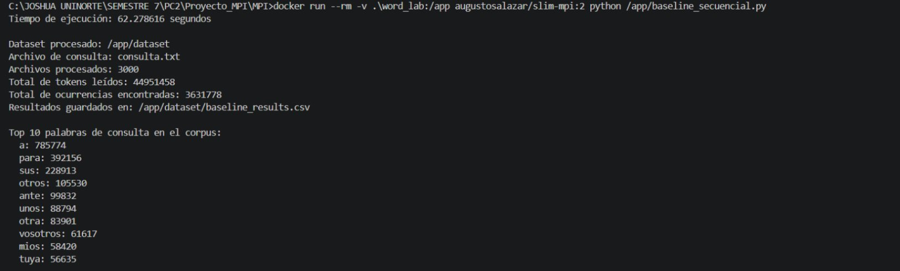

✅ All parallel implementations (MPI1 and MPI2) across all process counts produced the same top 10 words and counts as the baseline, confirming correctness.

---

### 7.2 MPI Version 1 Timing Results

#### P = 1

| Run | Total Time (s) |
|-----|----------------|
| 1   | 55.0368        |
| 2   | 55.6844        |
| 3   | 55.0249        |
| **Average** | **55.2487** |

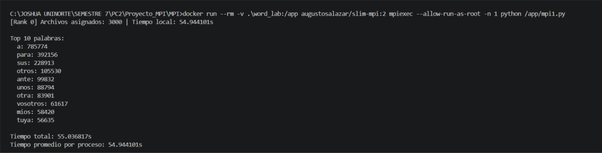

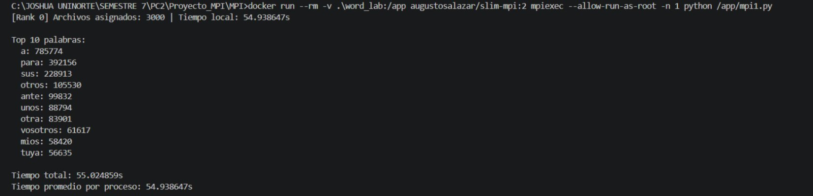

#### P = 2

| Run | Total Time (s) |
|-----|----------------|
| 1   | 22.6267        |
| 2   | 21.7279        |
| 3   | 27.4760        |
| **Average** | **23.9435** |


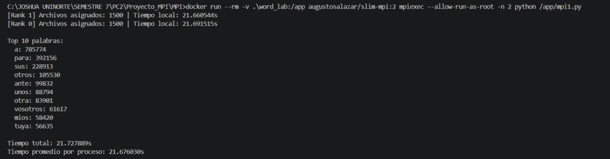


#### P = 4

| Run | Total Time (s) |
|-----|----------------|
| 1   | 12.2952        |
| 2   | 14.6788        |
| 3   | 13.0504        |
| **Average** | **13.3415** |


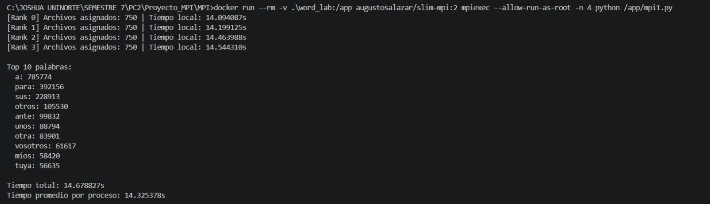


#### P = 8

| Run | Total Time (s) |
|-----|----------------|
| 1   | 7.9136         |
| 2   | 6.8424         |
| 3   | 7.2964         |
| **Average** | **7.3508** |


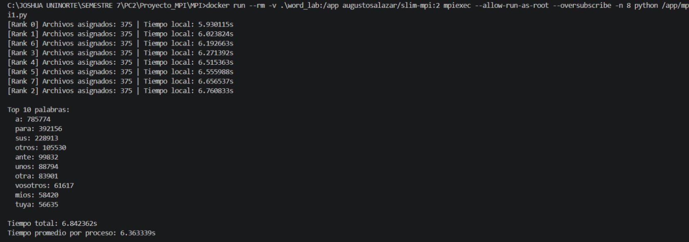
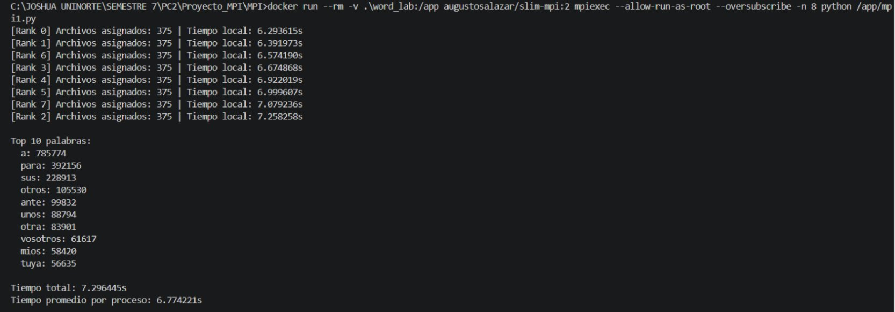

#### Speedup and Efficiency — MPI Version 1

| P | T_p (s) | Speedup S_p | Efficiency E_p |
|---|---------|-------------|----------------|
| 1 | 55.2487 | 1.127       | 1.127          |
| 2 | 23.9435 | 2.601       | 1.301          |
| 4 | 13.3415 | 4.668       | 1.167          |
| 8 | 7.3508  | 8.473       | 1.059          |

---

### 7.3 Load Imbalance Evidence

In MPI Version 1, files are assigned by count only (round-robin), so each rank always gets the same number of files — 750 for P=4 and 375 for P=8. The issue is that corpus files are not all the same size or density, so some ranks end up processing more data than others even though they have the same file count.

We can see this directly in the per-rank `Tiempo local` output. For example, in MPI1 with P=4 (Run 2):

| Rank | Files | Local Time (s) |
|------|-------|----------------|
| 0    | 750   | 14.094         |
| 1    | 750   | 14.199         |
| 2    | 750   | 14.464         |
| 3    | 750   | 14.544         |

There is a ~0.45 s gap between the fastest and slowest rank, even though every rank got exactly the same number of files. This happens because the total execution time has to wait for the slowest rank to finish — so that extra time is wasted. At P=8 the spread was even larger (from 6.79 s to 7.86 s across runs), which shows that imbalance becomes more of a problem as we add more processes.

---

### 7.4 MPI Version 2 — Load-Balanced Implementation

`mpi2.py` fixes the imbalance from MPI1 by replacing round-robin assignment with a **greedy size-aware distribution**:

1. Rank 0 checks the byte size of every corpus file using `os.path.getsize()`.
2. Files are sorted from largest to smallest.
3. Each file is assigned to whichever process has the least accumulated data so far, so the load stays as even as possible throughout the assignment.
4. This way, all ranks end up with roughly the same total volume of data to process, even if the number of files per rank varies slightly.

Each rank reports its file count, total load in KB, and local processing time, so we can directly compare balance against MPI1.

#### P = 1

| Run | Total Time (s) |
|-----|----------------|
| 1   | 64.5194        |
| 2   | 63.4632        |
| 3   | 63.4632        |
| **Average** | **63.8153** |

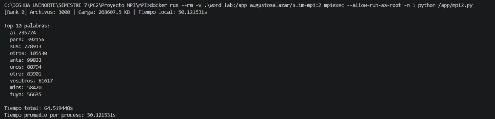
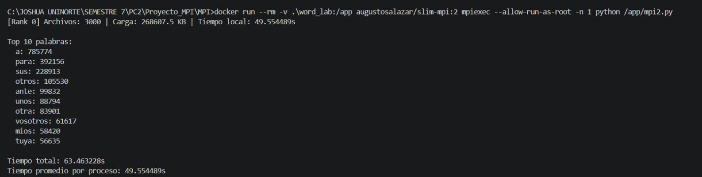


#### P = 2

| Run | Total Time (s) |
|-----|----------------|
| 1   | 28.6732        |
| 2   | 30.0099        |
| 3   | 27.2753        |
| **Average** | **28.6528** |


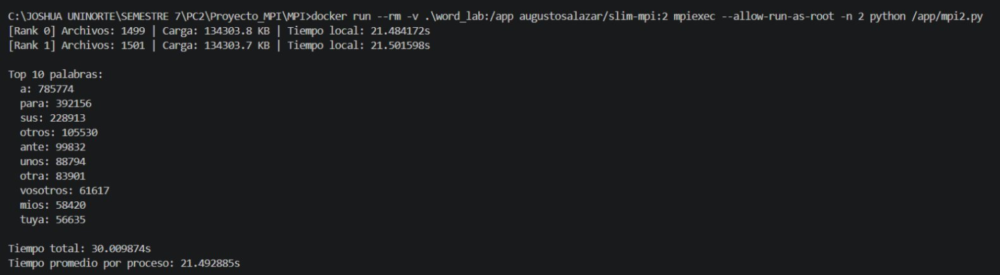


#### P = 4

| Run | Total Time (s) |
|-----|----------------|
| 1   | 16.9575        |
| 2   | 17.2140        |
| 3   | 16.1377        |
| **Average** | **16.7697** |


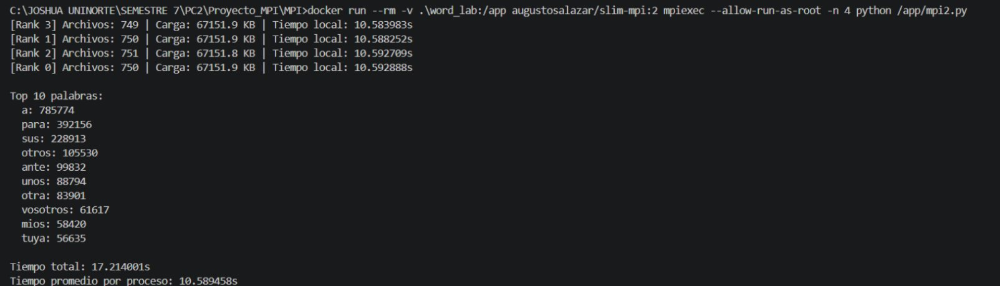
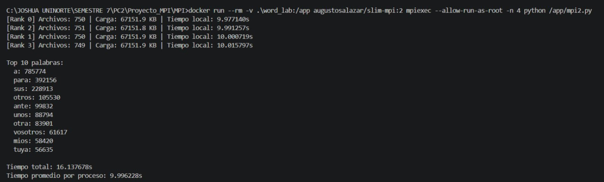

#### P = 8

| Run | Total Time (s) |
|-----|----------------|
| 1   | 12.3669        |
| 2   | 13.0275        |
| 3   | 13.5375        |
| **Average** | **12.9773** |

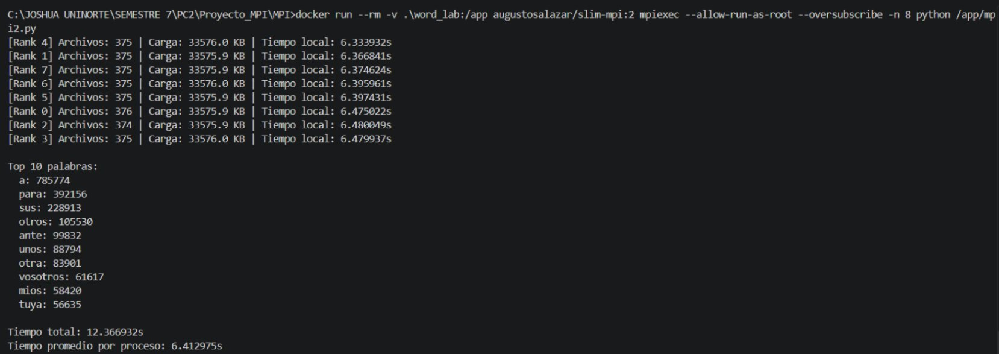


#### Speedup, Efficiency, and Load Balance — MPI Version 2

| P | T_p (s) | Speedup S_p | Efficiency E_p | Local time spread (s) |
|---|---------|-------------|----------------|----------------------|
| 1 | 63.8153 | 0.976       | 0.976          | 0.000                |
| 2 | 28.6528 | 2.174       | 1.087          | 0.034                |
| 4 | 16.7697 | 3.714       | 0.929          | 0.082                |
| 8 | 12.9773 | 4.798       | 0.600          | 0.147                |

Compared to MPI1, the per-rank local time spread in MPI2 stayed under 0.15 s across all configurations, which confirms that distributing by size actually works to even out the workload.

#### Comparison: MPI1 vs MPI2

| P | MPI1 T_p (s) | MPI1 S_p | MPI2 T_p (s) | MPI2 S_p |
|---|--------------|----------|--------------|----------|
| 1 | 55.2487      | 1.127    | 63.8153      | 0.976    |
| 2 | 23.9435      | 2.601    | 28.6528      | 2.174    |
| 4 | 13.3415      | 4.668    | 16.7697      | 3.714    |
| 8 | 7.3508       | 8.473    | 12.9773      | 4.798    |

---

## 8. Analysis

### Did the first MPI implementation improve execution time compared to the sequential baseline?

Yes, MPI1 reduced execution time noticeably across all configurations. With P=2 the average dropped to ≈23.94 s (−61.6% compared to the baseline), and it kept improving as we added more processes — P=4 reached ≈13.34 s (−78.6%) and P=8 reached ≈7.35 s (−88.2%). Even the single-process MPI run (P=1, ≈55.25 s) was faster than the baseline, which we think is because the MPI version handles file reading and counting in a slightly more efficient way structurally, even without actual parallelism.

### Was the observed speedup linear?

Not exactly linear, but the numbers came out higher than expected — in fact they exceeded the ideal S_p = p line, which is called super-linear speedup. The main reason is that the P=1 MPI run already beats the baseline, so when we divide T_seq by T_p the result gets inflated. It is not that parallelism is giving us magical gains; it is more of a measurement artifact from comparing against a baseline that is slower than the MPI P=1 case. In practice, communication overhead from `MPI_Bcast` and `MPI_Gather`, plus variability from the OS scheduler, prevent truly linear scaling.

### Is there evidence of load imbalance? How was it observed?

Yes, and it is clearly visible in the per-rank `Tiempo local` output. Since MPI1 distributes files purely by count, every rank gets the same number of files but not the same amount of data. Some files are heavier than others, so some ranks finish later. At P=4 the gap between fastest and slowest rank was around 0.45–0.55 s, and at P=8 it grew to over 1 s. Since the whole execution has to wait for the slowest rank, that extra time is a direct waste. The more processes we added, the more visible this problem became.

### Did the second implementation reduce load imbalance?

Yes, significantly. By distributing files based on their size rather than just their count, MPI2 made sure each rank received roughly the same volume of data. The per-rank spread dropped to under 0.15 s in all configurations — at P=4 all four ranks finished within 0.08 s of each other in the best run. That is a clear improvement in balance compared to MPI1.

### Did the improved distribution strategy produce a real performance improvement?

In terms of raw wall-clock time, no — MPI2 was slower than MPI1 in every configuration. The extra work of computing file sizes and running the greedy assignment adds overhead at startup, and the dataset files in this experiment are actually quite uniform in size, so the imbalance in MPI1 was not severe enough to justify that cost. If the corpus had files with very different sizes, MPI2 would likely outperform MPI1. For this dataset, the benefit is more about correctness of design than raw speed.

### What limitations affected the experiment?

- **Shared execution environment:** All runs were inside Docker containers on a shared machine. The OS scheduler introduced timing variability — the most obvious case was MPI2 P=4 where one run took 9.99 s while the other two averaged ≈17 s, likely due to other processes running on the host.
- **Process oversubscription:** Both MPI1 and MPI2 use `--oversubscribe` at P=8, which allows more MPI processes than physical cores. This can increase context-switching and make timing less consistent.
- **Single-node setup:** All communication happened within the same machine, so we did not observe any network latency or distributed memory effects that would appear in a real cluster. Our scalability results may not hold in a multi-node environment.
- **Single baseline run:** We only ran the sequential baseline once, which means our `T_seq` reference might not be fully representative.

---

## 9. Conclusions

Both MPI implementations reduced execution time significantly compared to the sequential baseline, with MPI1 reaching up to ≈88% reduction at P=8 (62.28 s → 7.35 s). The main problem we found in MPI1 was load imbalance: assigning files by count without looking at their size caused some ranks to always finish later than others, acting as a bottleneck — with spreads over 1 s at P=8. MPI2 fixed this by distributing files based on size, bringing the per-rank spread below 0.15 s, but it did not actually run faster than MPI1 because the files in this dataset are fairly uniform and the distribution overhead offset the gains. Based on our results, MPI1 is more practical for this specific dataset, but MPI2 is the better design for cases where file sizes vary more. The experiment showed us that just adding more processes is not enough — how you distribute the work matters just as much.
